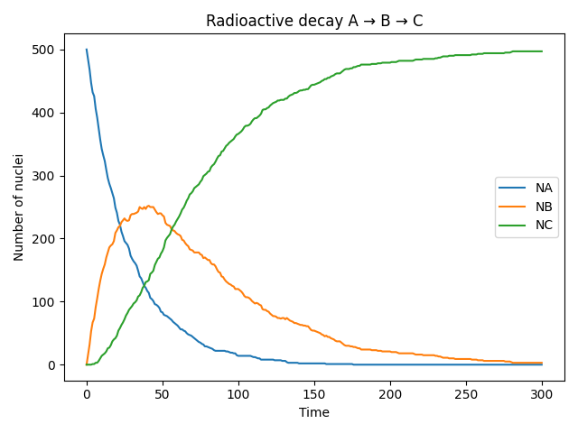
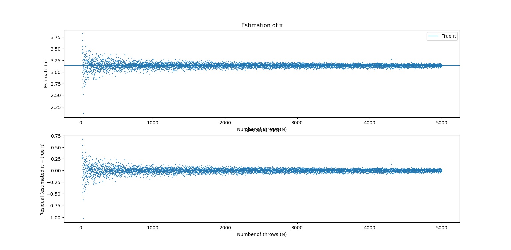
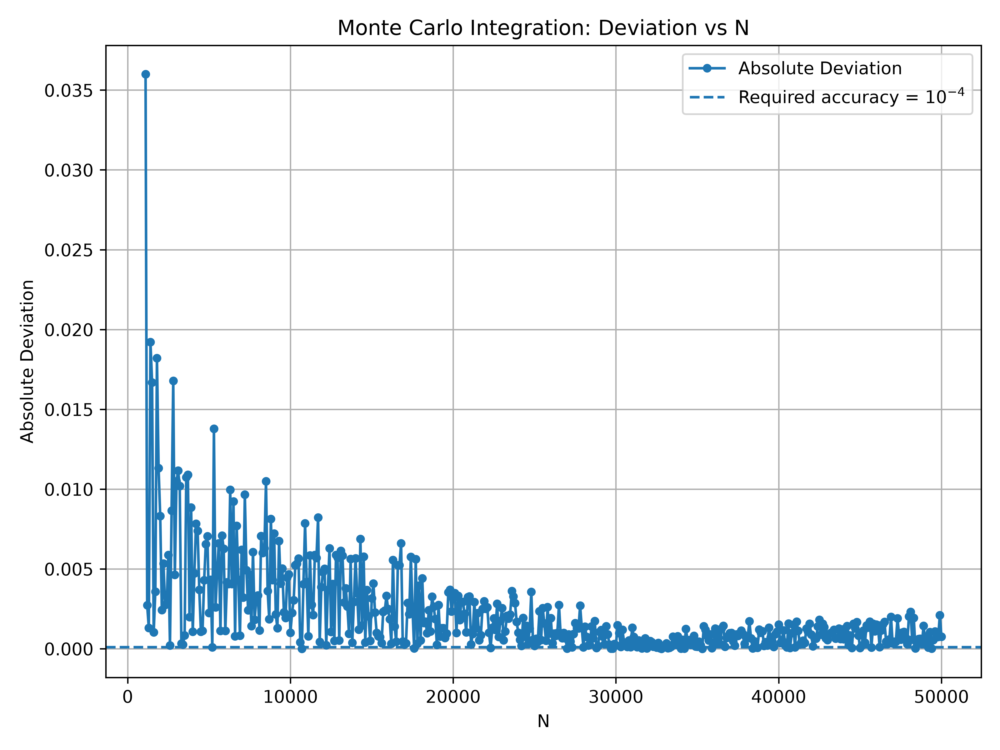
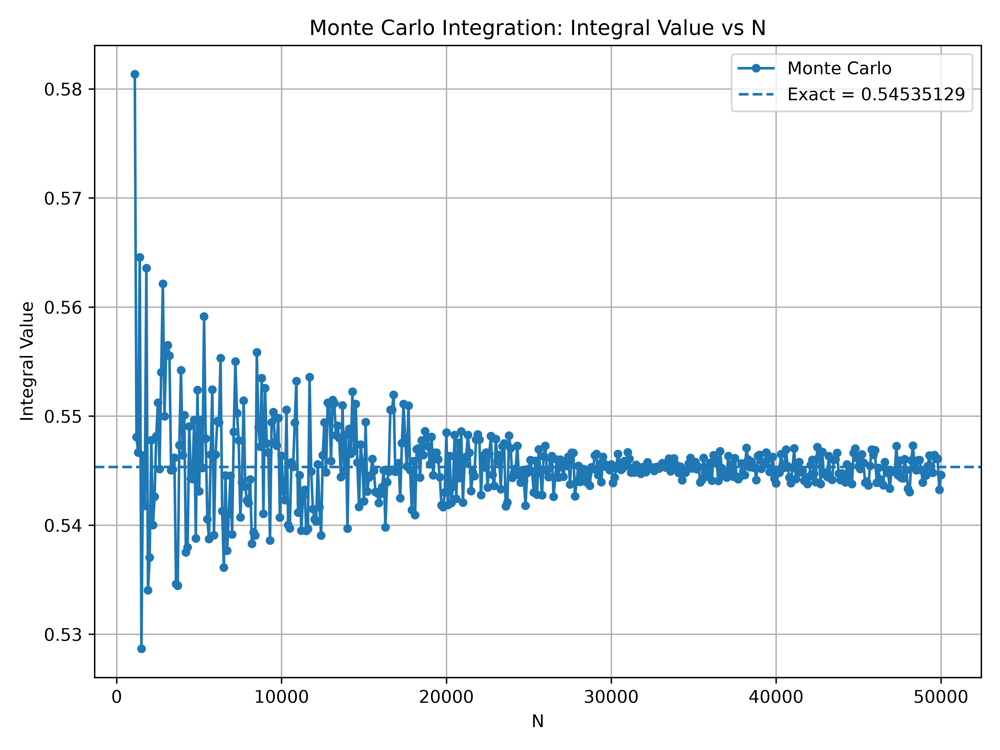
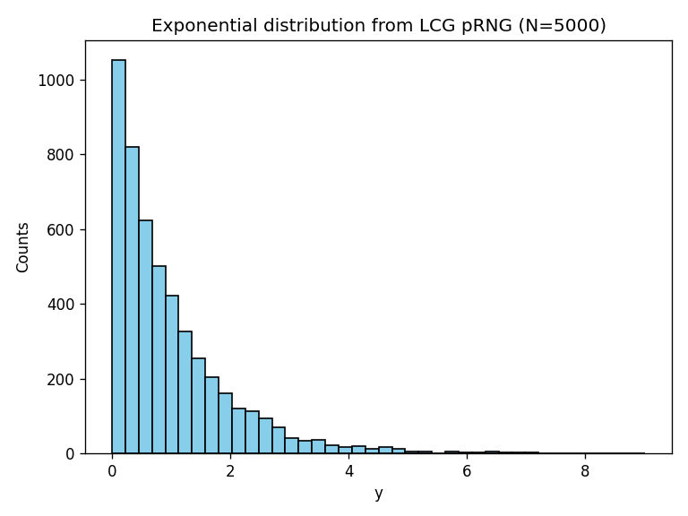
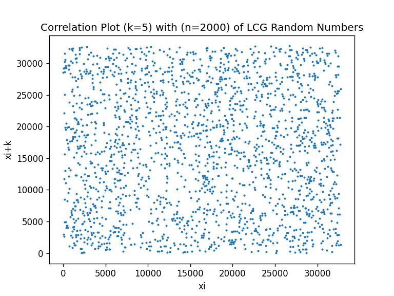

# Computational Physics & Scientific Computing Suite

[](https://www.python.org/)
[](LICENSE)
[](https://www.niser.ac.in)
[-brightgreen.svg)](#design-philosophy)

**Author:** [Aryan Bandyopadhyay](https://github.com/Aryans-lab)  
**Affiliation:** School of Physical Sciences, National Institute of Science Education and Research (NISER), Bhubaneswar  
**Course Reference:** PHY341 / PHY745 — Computational Physics  

---

## Overview & Design Philosophy

This repository is a self-contained scientific computing library and computational physics workbench implemented **entirely from first principles in pure Python**. 

Rather than relying on black-box numerical packages (`scipy`, `numpy.linalg`, or standard library `random`), every core algorithm—from matrix factorization and iterative relaxation to multidimensional root finding, orthogonal polynomial deflation, and spectral Gaussian quadrature—is built from scratch.

### Core Architectural Pillars
- **Zero Heavy Numerical Dependencies:** Algorithms are implemented in native standard library Python to expose the underlying linear algebra, floating-point mechanics (IEEE 754), condition numbers, and error bounds.
- **Central Scientific Engine (`mylib.py`):** A unified, modular library exposing direct solvers, iterative solvers, non-linear optimizers, polynomial roots, and quadrature routines.
- **Verification by Residuals:** Every linear solver and root finder is validated through formal numerical diagnostics ($\|Ax - b\|_2 \approx 10^{-16}$, analytical comparison, step-size convergence).
- **Physical Simulations:** Direct applications to decay chains, stochastic sampling, phase-space dynamics, and boundary value problems.

---

## Visual Gallery & Selected Simulations

### 1. Stochastic Physics: Radioactive Decay Kinetics ($A \to B \to C$)
Monte Carlo simulation of consecutive radioactive decays governed by coupled differential equations $dN_A/dt = -\lambda_A N_A$, $dN_B/dt = \lambda_A N_A - \lambda_B N_B$, $dN_C/dt = \lambda_B N_B$. Individual atomic decay decisions are simulated using transition probabilities $P = \lambda \Delta t$ via a custom LCG pseudo-random number generator without continuous ODE approximations.

<p align="center">
  
</p>

### 2. Monte Carlo Integration & Statistical Error Scaling ($O(N^{-1/2})$)
Evaluation of definite integrals and fundamental constants ($\pi$) via uniform Monte Carlo sampling. The empirical standard deviation and residual error closely trace the theoretical Central Limit Theorem scaling of $\sigma_I = (b - a) \sigma_f / \sqrt{N}$.

<p align="center">
  
  
</p>
<p align="center">
  
</p>

### 3. Non-Uniform Sampling & Correlation Analysis
- **Inverse Transform Method:** Generation of exponential deviates $q(y) = \lambda e^{-\lambda y}$ via $y = -\frac{1}{\lambda} \ln(u)$ benchmarked against exact distributions.
- **Phase Space & Lag Correlations:** Correlation testing $x_i$ vs $x_{i+k}$ comparing non-linear chaotic mappings ($x_{i+1} = c x_i (1 - x_i)$) with full-period Linear Congruential Generators (Hull-Dobell satisfied).

<p align="center">
  
  
</p>

---

## Numerical Algorithms Blueprint (`mylib.py`)

The heart of this repository is [`mylib.py`](mylib.py), structured into modular mathematical disciplines:

```
mylib.py
├── 1. Pseudo-Random Number Generation & Distributions (LCG, Uniform, Exponential)
├── 2. Complex Numbers & Vector Algebra (MyComplex, Vector Norms, Dot Products)
├── 3. Matrix Utilities & Non-Interactive File I/O (I/O, Transpose, Residuals, Verification)
├── 4. Direct Linear Solvers (Gauss-Jordan, Matrix Inversion, Doolittle LU, Determinants)
├── 5. Symmetric Positive-Definite Systems (Cholesky Factorization & Solver)
├── 6. Iterative Linear Solvers (Jacobi, Gauss-Seidel, Successive Over-Relaxation)
├── 7. Non-Linear Root Finding (Bisection, Regula Falsi, Fixed-Point, 1D & Multivariate Newton-Raphson)
├── 8. Polynomial Solvers & Deflation (Horner's Scheme, Laguerre's Method, Synthetic Division)
└── 9. Numerical Integration & Quadrature (Midpoint, Trapezoidal, Simpson 1/3, Monte Carlo, Gauss-Legendre, Gauss-Laguerre)
```

### Module Summary & Analytical Properties

| Module / Method | Mathematical Foundation | Order / Complexity | Key Feature / Constraint |
|---|---|---|---|
| **LCG (`myrand`)** | $x_{i+1} = (a x_i + c) \pmod m$ | $O(1)$ | Full cycle ($m = 32768, a = 1103515245, c = 12345$) |
| **Gauss-Jordan** | $[A \mid b] \xrightarrow{\text{RREF}} [I \mid x]$ | $O(n^3)$ | Partial row pivoting; detects singularity & inconsistency |
| **LU Decomposition** | $A = L U$ (Doolittle: $L_{ii} = 1$) | $O(\frac{2}{3} n^3)$ | Forward-backward substitution; $\det(A) = \prod U_{ii}$ free |
| **Cholesky Factorization** | $A = L L^T$ | $O(\frac{1}{3} n^3)$ | $2\times$ faster than LU; verifies symmetry & positive definiteness |
| **Jacobi Iteration** | $x^{(k+1)} = D^{-1} [b - (L+U) x^{(k)}]$ | Iterative | Decoupled updates; easily parallelizable; diagonal dominance |
| **Gauss-Seidel** | $x_i^{(k+1)} = \frac{1}{A_{ii}} [b_i - \sum_{j < i} A_{ij} x_j^{(k+1)} - \sum_{j > i} A_{ij} x_j^{(k)}]$ | Iterative | Sequential in-place updates; faster spectral radius convergence |
| **SOR** | $x^{(k+1)} = (1 - \omega) x^{(k)} + \omega x_{GS}^{(k+1)}$ | Iterative | Tunable $\omega \in (1, 2)$ accelerates convergence by up to $6\times$ |
| **Bisection & Regula Falsi** | Intermediate Value Theorem | Linear / Superlinear | Auto-bracketing outward expansion; guaranteed convergence |
| **1D Newton-Raphson** | $x_{n+1} = x_n - f(x_n) / f'(x_n)$ | Quadratic ($O(e_n^2)$) | Supports analytical $f'(x)$ or $O(h^2)$ central differences |
| **Multivariate Newton-Raphson** | $x^{(k+1)} = x^{(k)} - [J(x^{(k)})]^{-1} F(x^{(k)})$ | Quadratic | Computes numerical Jacobian $J \in \mathbb{R}^{n \times n}$ & inverts via GJ |
| **Laguerre's Method** | $a = n / [G \pm \sqrt{(n-1)(nH - G^2)}]$ | Cubic near simple roots | Isolates complex/real roots; paired with synthetic deflation |
| **Simpson's 1/3-Rule** | Piecewise quadratic interpolation | Error $O(h^4) \sim \frac{(b-a)^5}{180 N^4} M_4$ | Requires even $N$; high precision on smooth integrands |
| **Monte Carlo Quadrature** | $I \approx (b - a) \langle f \rangle$ | Error $O(N^{-1/2})$ | Dimension-independent convergence; ideal for multi-variable integrals |
| **Gaussian Quadrature** | $\int w(x) f(x) dx \approx \sum w_i f(x_i)$ | Exact for $\deg(P) \le 2N - 1$ | **Legendre:** on $[-1, 1]$; **Laguerre:** on $[0, \infty)$ with weight $e^{-x}$ |

---

## Detailed Topic Directory

Each folder represents an in-depth module featuring driver scripts, test matrices, numerical outputs, and plots:

- [`Assgn0/`](Assgn0/): **Foundational Numerics & Matrix Mechanics**
  - Custom `MyComplex` arithmetic class, summation of non-trivial series without analytical shortcuts, ASCII matrix I/O routines.
- [`assign1_rand/`](assign1_rand/): **Stochastic Methods, PRNGs, & Decay Chains**
  - LCG engine, Hull-Dobell theorem validation, lag correlation plots, Monte Carlo $\pi$ estimation, radioactive decay series ($A \to B \to C$), and exponential sampling.
- [`assign2_gj_lu/`](assign2_gj_lu/): **Direct Linear Solvers: Gauss-Jordan & Doolittle LU**
  - Row pivoting, non-singular condition monitoring, matrix inversion, and $L \cdot U$ verification.
- [`assign3_lu_chsk/`](assign3_lu_chsk/): **Forward-Backward Substitution & Cholesky Factorization**
  - Solving $6 \times 6$ linear systems via forward ($Ly = b$) and backward ($Ux = y$) substitution, Cholesky decomposition of symmetric positive-definite systems.
- [`assign4_jac_gs/`](assign4_jac_gs/): **Stationary Iterative Methods & Spectral Acceleration**
  - Jacobi vs. Gauss-Seidel convergence dynamics, diagonal dominance transformations, and Successive Over-Relaxation (SOR) with $\omega = 1.57$.
- [`assign5_bi_rf/`](assign5_bi_rf/): **Root Finding: Bisection & Regula Falsi**
  - Automated bracketing routines and transcendental equation root solving with rigorous error tolerance.
- [`assign5_fx_nr/`](assign5_fx_nr/): **Fixed-Point Iteration & Multidimensional Newton-Raphson**
  - Picard iteration $|g'(x)| < 1$, convergence rate comparisons (Bisection vs. Regula Falsi vs. Newton), and non-linear coupled systems using numerical Jacobians.
- [`assign5_poly/`](assign5_poly/): **Polynomial Roots: Horner, Laguerre, & Synthetic Deflation**
  - $O(n)$ polynomial evaluation and derivative tracking, Laguerre root isolation, and synthetic division deflation.
- [`assign6_midtrap/`](assign6_midtrap/): **Closed Newton-Cotes Quadrature**
  - Composite Midpoint and Trapezoidal integration rules with analytical error benchmarks.
- [`assign6b_simmc/`](assign6b_simmc/): **Simpson's Rule & Monte Carlo Quadrature**
  - $O(h^4)$ Simpson integration, theoretical $N$ selection from fourth derivative bounds, and Monte Carlo variance tracking.
- [`assign6c_gq/`](assign6c_gq/): **Orthogonal Polynomial Quadrature (Gauss-Legendre & Gauss-Laguerre)**
  - Unified Gaussian quadrature for finite and semi-infinite intervals ($[0, \infty)$) with tabulated roots and weights ($N = 1$ to $6$).

---

## Quickstart & Usage

### 1. Solving a Linear System ($Ax = b$) with Verification
```python
from mylib import lu_forback, matrix_residual, print_matrix

A = [
    [4.0, 1.0, -1.0],
    [1.0, 4.0, -1.0],
    [-1.0, -1.0, 5.0]
]
b = [6.0, 25.0, -11.0]

# Solve via LU decomposition (Doolittle)
x = lu_forback(A, b, method='lu')
print_matrix(x, label="Solution Vector x")

# Verify numerical integrity via residual norm ||Ax - b||_2
res = matrix_residual(A, x, b)
print(f"Residual Norm: {res:.2e}")  # Typically ~ 1e-16
```

### 2. Finding All Real Roots of a High-Degree Polynomial
```python
from mylib import laguerre_roots

# P(x) = x^4 - x^3 - 7x^2 + x + 6 = 0
coefficients = [1, -1, -7, 1, 6]

roots, iterations = laguerre_roots(coefficients, b0=1.0)
for i, (r, it) in enumerate(zip(roots, iterations)):
    print(f"Root {i+1}: {r:10.6f} (found in {it} iterations)")
# Output: 1.0, -1.0, -2.0, 3.0
```

### 3. Comparing Simpson's Rule vs. Gauss-Legendre Quadrature
```python
import math
from mylib import simpson, gaussian_quadrature

f = lambda x: x**2 / (1.0 + x**4)
a, b = -1.0, 1.0

# 4-point Gauss-Legendre achieves near machine accuracy
val_gq = gaussian_quadrature(f, a, b, N=4, method='legendre')

# Simpson 1/3 requires N >= 20 for equivalent accuracy
val_simp, evals = simpson(f, a, b, N=20)

print(f"Gauss-Legendre (N=4):  {val_gq:.9f}")
print(f"Simpson 1/3   (N=20): {val_simp:.9f} ({evals} evaluations)")
```

---

## Author & Academic Context

Developed by **Aryan Bandyopadhyay** (`2411014`), 3rd-year Integrated M.Sc. Physics student at the **National Institute of Science Education and Research (NISER)**, Bhubaneswar.

For an exhaustive technical breakdown of course requirements, examination criteria, and algorithmic mechanics, see [`COURSE_CONTEXT.md`](COURSE_CONTEXT.md).

---

## License

This project is licensed under the [MIT License](LICENSE).
