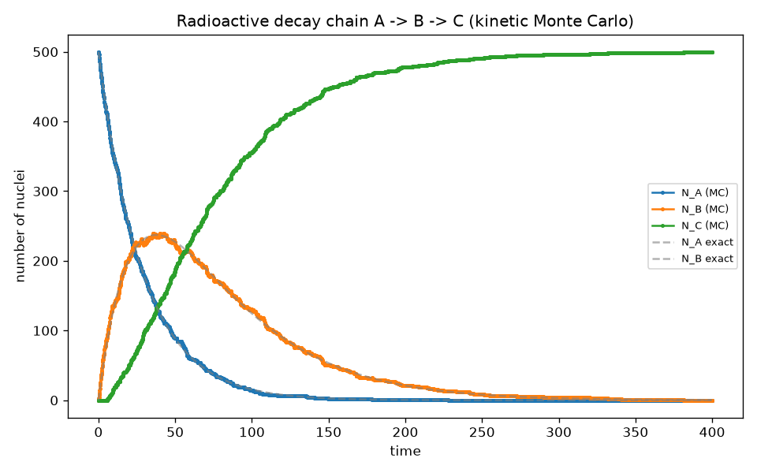
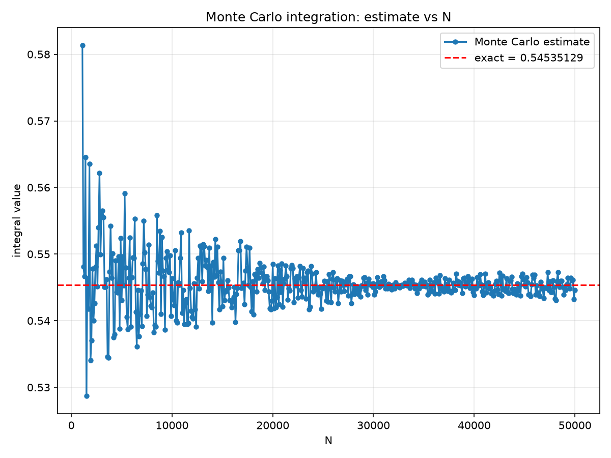
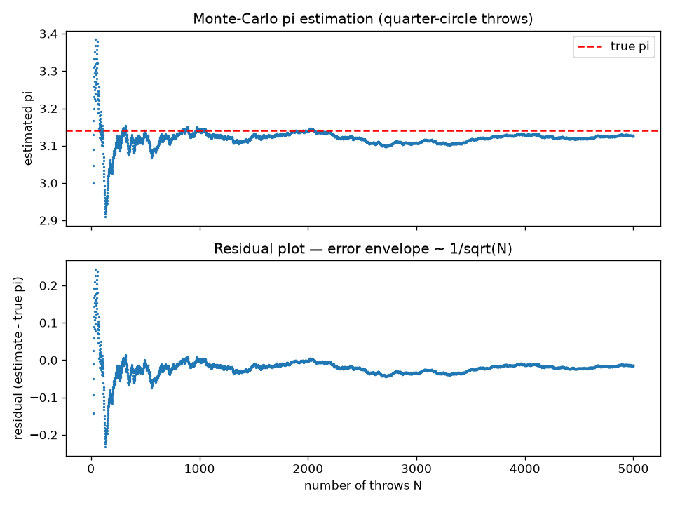

# Computational Physics — a First-Principles Numerical Workbench

[](https://github.com/Aryans-lab/Computational_Physics_Lab/actions/workflows/ci.yml)
[](https://www.python.org/)
[](LICENSE)
[](#design-philosophy)

Every numerical routine in this repository — matrix factorisation, iterative
relaxation, non-linear root finding, polynomial deflation, and
Gaussian quadrature — is implemented **from first principles in pure
standard-library Python**. No `numpy`, no `scipy`, no black boxes: the point
is to *see* the linear algebra, the floating-point behaviour, and the error
bounds working. NumPy and Matplotlib appear only where they belong —
plotting, and an independent reference in the test suite.

The work grew out of the computational physics coursework at NISER
(PHY341/745, 2025–26) and has since been organised into a single,
reproducible workbench: one canonical library, one driver per problem,
golden outputs committed to git, a unit-test + regression suite, and CI.

**Author:** Aryan Bandyopadhyay — [github.com/Aryans-lab](https://github.com/Aryans-lab)

---

## What's inside

```
.
├── mylib.py                  # the whole numerical library (pure stdlib)
├── assignments/              # one self-contained folder per course week
│   ├── week00_warmup/        #   Python fundamentals, MyComplex, matrix I/O
│   ├── week01_random/        #   LCG PRNG, π, decay chains, exponential sampling
│   ├── week02_gauss_jordan_lu/  # Gauss-Jordan, inversion, Doolittle LU
│   ├── week03_lu_cholesky/   #   LU forward-backward, Cholesky
│   ├── week04_jacobi_gs/     #   Jacobi, Gauss-Seidel, SOR
│   ├── week05a_bisection_regf/  # bracketing: bisection, regula falsi
│   ├── week05b_fixedpoint_newton/  # fixed-point, Newton (1-D & multivariate)
│   ├── week05c_polynomial_roots/   # Laguerre's method + synthetic deflation
│   ├── week06a_midpoint_trapezoid/  # closed Newton-Cotes rules
│   ├── week06b_simpson_montecarlo/  # Simpson's 1/3, Monte Carlo quadrature
│   └── week06c_gaussian_quadrature/ # Gauss-Legendre & Gauss-Laguerre
│       (each: questionN.py + data/ + output/ + figures/ + mylib.py)
├── tests/                    # unit tests + golden-output regression
├── scripts/                  # bundle.py, run_all.py
├── Makefile                  # make all = bundle + run + lint + test
└── .github/workflows/ci.yml  # Python 3.10 & 3.12
```

### The design rule (and why it matters)

The course convention this project was built under: **all numerical
routines live in `mylib.py` in the same directory as the front code; front
code does I/O only; no NumPy/SciPy in the core.** The rule is preserved
exactly — `mylib.py` at the repository root is the single source of truth,
and `scripts/bundle.py` copies it verbatim into every week folder, so each
folder remains independently submittable and runnable.

### Verification, not faith

- Every linear solver is checked by residual: `‖Ax − b‖₂ ≈ 1e-12–1e-16`
- LU is reassembled as `L·U` and compared to `P·A`; determinants are
  cross-checked against the permutation sign
- Convergence orders are measured empirically (error ratios on doubling `N`)
- The Gaussian tables are checked against NumPy's independently computed
  nodes/weights
- The LCG's full period of 2¹⁵ is enumerated
- `tests/test_assignments.py` re-runs **all 36 drivers** in a sandbox and
  byte-compares the regenerated outputs against the committed ones — the
  numbers in `output/` are exactly what the current code produces

## The library at a glance

| Method | Mathematics | Order / cost | Notable guard-rails |
|---|---|---|---|
| **LCG** `myrand` | $x_{k+1} = (a x_k + c) \bmod m$ | $O(1)$ | Hull-Dobell parameters; full period $m = 2^{15}$ verified |
| **Gauss-Jordan** | $[A\mid b] \to [I \mid x]$ via RREF | $O(n^3)$ | scale-relative pivoting; distinguishes inconsistent vs dependent vs non-square |
| **LU (Doolittle)** | $PA = LU$, unit lower $L$ | $O(\tfrac{2}{3}n^3)$ | partial pivoting; $P$ tracked as a permutation; zero-pivot detection |
| **Cholesky** | $A = LL^T$ | $O(\tfrac{1}{3}n^3)$ | symmetry + positive-definiteness checked before factoring |
| **Jacobi / G-S / SOR** | stationary / over-relaxed iteration | spectral radius $\rho < 1$ | diagonal dominance checked; SOR tuned ($\omega = 1.57$ on the Poisson model) |
| **Bisection / Regula Falsi** | IVT bracketing | linear / superlinear | automatic bracket *expansion* when the given interval has no sign change |
| **Fixed point** | $x = g(x)$, $\lVert g' \rVert < 1$ | linear | iteration-count reporting for rate analysis |
| **Newton (1-D, N-D)** | $x_{k+1} = x_k - f/f'$; $J\,\delta x = -F$ | quadratic | analytic *or* central-difference derivatives; N-D step solved by GJ, never by inverting $J$ |
| **Laguerre + deflation** | $a = \dfrac{n}{G \pm \sqrt{(n-1)(nH - G^2)}}$ | cubic near simple roots | real-roots-only by design; double roots degrade gracefully (0.49998 / 0.50002) |
| **Midpoint / Trapezoid** | closed Newton-Cotes | $O(h^2)$ | error-bound solver for minimal $N$ |
| **Simpson 1/3** | piecewise quadratics | $O(h^4)$ | even-$N$ enforcement; evaluation count reported |
| **Monte Carlo** | $I \approx (b-a)\langle f\rangle$ | $O(N^{-1/2})$ | seeded (reproducible); returns $\sigma_f$ and $\sigma_I$ |
| **Gauss-Legendre / Laguerre** | $\sum w_i f(x_i)$, orthogonal nodes | exact for $\deg \le 2n-1$ | one routine, two families; tables for $n = 1\dots 6$; $[0,\infty)$ with weight $e^{-x}$ |

The full API map lives in [`mylib.py`](mylib.py)'s module docstring.

## Selected results

### Radioactive decay, $A \to B \to C$ (week01)
Monte Carlo of consecutive decays, each nucleus deciding by
$P = \lambda\,\Delta t$ — no ODE solver, pure counting statistics.

<p align="center">
  
</p>

### Monte Carlo quadrature and the $O(N^{-1/2})$ law (week06b)
$\int_{-1}^{1} \sin^2 x\,dx$ with the in-house LCG: the estimate wanders
inside its standard error, and the deviation plot is the textbook
fluctuation band that deterministic rules never show.

<p align="center">
  
  
</p>

### π by Monte Carlo, with the residual (week01)

<p align="center">
  
</p>

### SOR acceleration (week04)
On the 10×10 Poisson model problem, Gauss-Seidel needs 339 iterations at
$\text{tol} = 10^{-12}$; SOR with $\omega = 1.57$ — the analytic optimum for
this geometry — does it in 58.

## Quickstart

```bash
# everything: bundle the library, run all 36 drivers, lint, test
make all

# or piecewise:
python scripts/bundle.py        # mylib.py -> every week folder (idempotent)
python scripts/run_all.py       # run every question*.py, report ok/FAIL
python -m pytest tests -q       # unit tests + golden-output regression
```

Any single driver runs with zero arguments from anywhere:

```bash
python assignments/week02_gauss_jordan_lu/question2.py
# Output written to: .../week02_gauss_jordan_lu/output/q2_output.txt
```

### Using the library

```python
from mylib import lu_forback, matrix_residual, laguerre_roots, gaussian_quadrature

# 1. solve a linear system and verify the residual
A = [[4.0, 1.0, -1.0], [1.0, 4.0, -1.0], [-1.0, -1.0, 5.0]]
b = [6.0, 25.0, -11.0]
x = lu_forback(A, b)                      # Doolittle LU, partial pivoting
print(matrix_residual(A, x, b))           # ~1e-16

# 2. all real roots of x^4 - x^3 - 7x^2 + x + 6
roots, iters = laguerre_roots([1, -1, -7, 1, 6], b0=1.0)
print(roots)                              # ~ [-2, -1, 1, 3]

# 3. one quadrature routine, two orthogonal families
f = lambda x: x * x / (1.0 + x ** 4)
print(gaussian_quadrature(f, -1, 1, N=4, method="legendre"))   # 0.48163548...
print(gaussian_quadrature(lambda x: 1.0/(1.0+x), 0, 0, N=5,
                          method="laguerre"))                  # 0.595084...
```

## Coursework context

This repository is the worked set for **PHY341/745 (Computational Physics)**,
School of Physical Sciences, NISER Bhubaneswar — 2025–26. Each
`assignments/weekNN_*/` folder is a complete, self-contained submission
(driver scripts, input data, committed outputs, figures, and its own copy of
`mylib.py`), so the folders can be read or submitted exactly as the course
prescribed; the test suite, CI, and bundling layer are the additions that
turn the coursework into a maintained project.

## License

[MIT](LICENSE)
